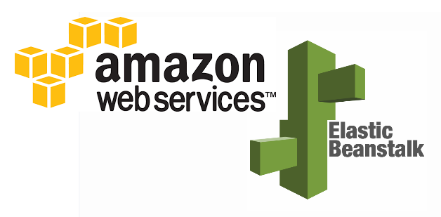

# Udagram Image Filtering Microservice

> Udagram is a simple cloud application developed alongside the Udacity Cloud Engineering Nanodegree. It allows users to register and log into a web client, post photos to the feed, and process photos using an image filtering microservice.





## Description

The project is split into three parts:
1. [The Simple Frontend](/udagram-frontend)
A basic Ionic client web application which consumes the RestAPI Backend. 
2. [The RestAPI Feed Backend](/udagram-restapi-feed), a Node-Express feed microservice.
3. [The RestAPI User Backend](/udagram-restapi-user), a Node-Express user microservice.

## Getting Setup

> _tip_: this frontend is designed to work with the RestAPI backends). It is recommended you stand up the backend first, test using Postman, and then the frontend should integrate.

### Installing Node and NPM
This project depends on Nodejs and Node Package Manager (NPM). Before continuing, you must download and install Node (NPM is included) from [https://nodejs.com/en/download](https://nodejs.org/en/download/).

### Installing Ionic Cli
The Ionic Command Line Interface is required to serve and build the frontend. Instructions for installing the CLI can be found in the [Ionic Framework Docs](https://ionicframework.com/docs/installation/cli).

### Installing project dependencies

This project uses NPM to manage software dependencies. NPM Relies on the package.json file located in the root of this repository. After cloning, open your terminal and run:
```bash
npm install
```
>_tip_: **npm i** is shorthand for **npm install**

### Setup Backend Node Environment
You'll need to create a new node server. Open a new terminal within the project directory and run:
1. Initialize a new project: `npm init`
2. Install express: `npm i express --save`
3. Install typescript dependencies: `npm i ts-node-dev tslint typescript  @types/bluebird @types/express @types/node --save-dev`
4. Look at the `package.json` file from the RestAPI repo and copy the `scripts` block into the auto-generated `package.json` in this project. This will allow you to use shorthand commands like `npm run dev`


### Configure The Backend Endpoint
Ionic uses enviornment files located in `./src/enviornments/enviornment.*.ts` to load configuration variables at runtime. By default `environment.ts` is used for development and `enviornment.prod.ts` is used for produciton. The `apiHost` variable should be set to your server url either locally or in the cloud.

***
### Running the Development Server
Ionic CLI provides an easy to use development server to run and autoreload the frontend. This allows you to make quick changes and see them in real time in your browser. To run the development server, open terminal and run:

```bash
ionic serve
```

### Building the Static Frontend Files
Ionic CLI can build the frontend into static HTML/CSS/JavaScript files. These files can be uploaded to a host to be consumed by users on the web. Build artifacts are located in `./www`. To build from source, open terminal and run:
```bash
ionic build
```
***

### Running project locally as docker containers

Steps 1 - 3 are one time only steps. 

1. Set the appropriate values for the below environment variables: 
```
export POSTGRESS_USERNAME=<postgress database username>
export POSTGRESS_PASSWORD=<postgress database password>
export POSTGRESS_DB=<postgress dababase name>
export POSTGRESS_HOST=<postgress database instance hostname>
export AWS_REGION=<aws region where bucket and database are located>
export AWS_PROFILE=<aws profile for credentials>
export AWS_BUCKET=<aws bucket name for storing images>
export JWT_SECRET=<secret string for encoding passwords>
```

2. Install docker desktop: https://docs.docker.com/get-docker/

3. Install docker-compose: https://docs.docker.com/compose/install/

4. Build Images - 
```docker-compose -f udagram-deployment/docker/docker-compose-build.yaml build --parallel```

5. Verify Images - 
```docker images```

6. Push images -

This step is optional for running the app as docker container. 
```
docker push <dockerhubusername>/udagram-restapi-feed:latest
docker push <dockerhubusername>/udagram-restapi-user:latest
docker push <dockerhubusername>/udagram-frontend:local
docker push <dockerhubusername>/udagram-reverseproxy:latest
```

If you don't want to do this step. Change the line that says ```imagePullPolicy: Always``` to ```imagePullPolicy: Never``` in all *-deployment.yaml files in udacity-c3-deployment/k8s/. This is required to run the app on a local kubernetes cluster. 

7. Run app - 
```cd udagram-deployment/docker/ && docker-compose up```

8. Verify application : 

Open localhost:8100 in browser.

9. Stop app - 
```cd udagram-deployment/docker/ && docker-compose down```

***

### Running app as a deployement on local kubernetes
If you have already followed steps for deploying as docker container then you can follow steps below. If not, then follow steps 1-6 from the previous section and then continue from here.

1. Enable kubernetes on docker desktop.

Docker desktop app > Preferences(Settings on windows) > Kubernetes > Check "Enable Kubernetes"

This will take a few minutes to setup and download the cli.

Verify running the below command on terminal

```kubectl cluster-info```

2. Setup additional environment variables.
```
export AWS_CREDENTIALS=<base64 encoded AWS credentials file>
export POSTGRESS_USERNAME=<base64 encoded POSTGRESS username>
export POSTGRESS_PASSWORD=<base64 encoded POSTGRESS password>
```

3. Verify : 

```
kubectl get all
```
This should show 
- deployments for backend-user, backend-feeds, reverseproxy, frontend. 
- pods for backend-user, backend-feeds, reverseproxy, frontend.
- services for backend-user, backend-feeds, reverseproxy, frontend.

4. Setup port forwarding :

```
kubectl port-forward services/reverseproxy 8080:8080 &
kubectl port-forward services/frontend 8100:8100 &
```

5. Verify application : 

Open localhost:8100 in browser.

***

### Using Travis CI to deploy on AWS infrastructure.

The repo has travis ci build instructions in .travisci.yaml. Follow below steps to create a build plan.

1. Integrate GIT with Travis CI - https://travis-ci.org/
2. On Travis CI setup the following env variables for the repo/branch.
```
DOCKER_USERNAME=<dockerhub username>
DOCKER_PASSWORD=<dockerhub password>
AWS_CREDENTIALS=<base64 encoded AWS IAM credentials with adequate policy>
POSTGRESS_USERNAME=<base64 encoded postgress db username>
POSTGRESS_PASSWORD=<base64 encoded postgress db password>
AWS_BUCKET=<aws bucket name for storing app images>
AWS_PROFILE=<aws profile>
AWS_REGION=<aws region>
JWT_SECRET=<secret string for encrypting app passwords>
POSTGRESS_DB=<postgress db name>
POSTGRESS_HOST=<postgress db instance hostname>
```
3. Trigger a build from the Travis CI dashboard.

***

### Public Images for the project - 

* [udagram-reverseproxy](https://hub.docker.com/repository/docker/pembeweb/udagram-reverseproxy)
* [udagram-frontend](https://hub.docker.com/repository/docker/pembeweb/udagram-frontend)
* [udagram-restapi-user](https://hub.docker.com/repository/docker/pembeweb/udagram-restapi-user)
* [udagram-restapi-feed](https://hub.docker.com/repository/docker/pembeweb/udagram-restapi-feed)

***

## Built With

* [Javascript](https://en.wikipedia.org/wiki/JavaScript) - The programming language used
* [Node.js®](https://nodejs.org/) - The JavaScript runtime used
* [Express.js®](https://nodejs.org/) - The web application framework used
* [AWS Elastic Beanstalk](https://aws.amazon.com/elasticbeanstalk/) - AWS deployment and scaling service used
* [Docker](https://www.docker.com/) - The container engine used
* [Travis CI](https://travis-ci.com/) - The continuous integration service used

## Authors

* **[Pemberai Sweto](https://github.com/thepembeweb)** - *Initial work* - [Udagram Image Filtering Microservice](https://github.com/thepembeweb/udagram-microservices-app)

## License

[](http://badges.mit-license.org)

- This project is licensed under the MIT License - see the [LICENSE.md](LICENSE.md) file for details
- Copyright 2020 © [Pemberai Sweto](https://github.com/thepembeweb).


